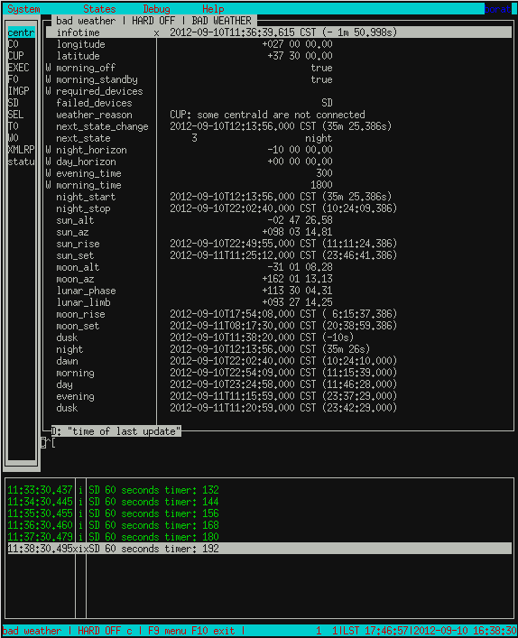
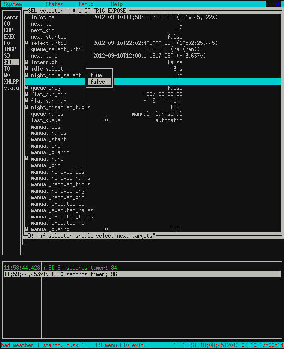
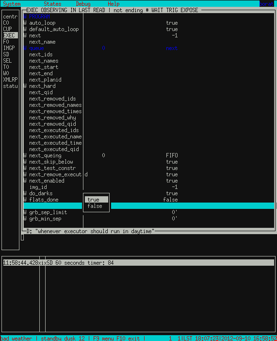
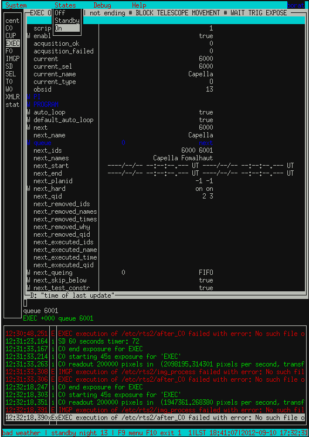
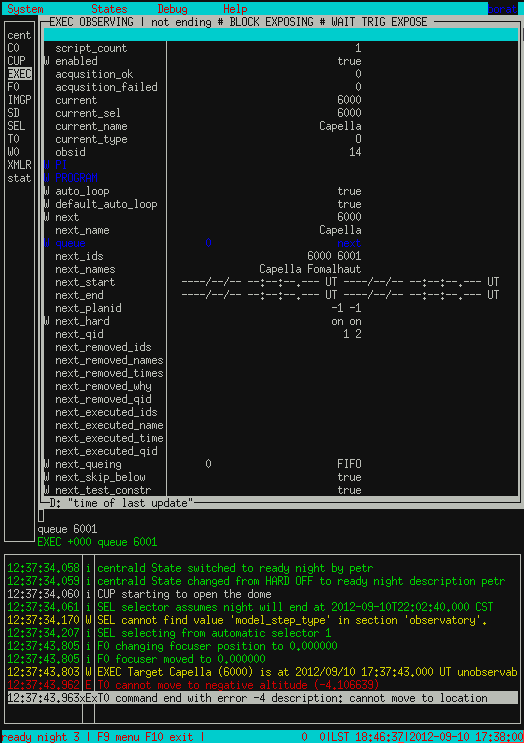

RTS2 Operation
**************

Operations
==========
The state of BORAT is close to its final state. With each fix, the
commands required to run an observation is less. At some point, it will
almost run itself, and that point is close.

Preparations
------------
If BORAT has already been running skip to next section.

The first main step to running the observatory with everything shutdown is to
bring everything back up. First thing to check is power. Log into the webswitch
with your favorite browser.

Make sure the required devices such as telescope, CCD, focuser, etc 
are powered and turned on.
Next step is to start up rts2 itself. Log into BORAT via bakerobs.limatech.net.
Once logged in stop rts2 to make sure no remaining service is active.::

    mr337@borat: sudo service rts2 stop
     * Stopping centrald daemon rts2-centrald                    [fail]

When stopping the service you may get a bunch of text that looks like a stack
trace. This is OK and is not something to be worried about. I prefer to run
the above command several times till I receive the above output. 

The next step is to start rts2. This is done with the above command by replacing
stop with start.::

    mr337@borat: sudo service rts2 start
    * Starting RTS2 centrald daemon on port 617 rts2-centrald    [ OK ] 
    * Starting C0 rts2-camd-dummy                                [ OK ] 
    * Starting T0 rts2-teld-dummy                                [ OK ] 
    * Starting W0 rts2-filterd-dummy                             [ OK ] 
    * Starting F0 rts2-focusd-dummy                              [ OK ] 
    * Starting CUP rts2-cupola-dummy                             [ OK ] 
    * Starting SD rts2-sensor-dummy                              [ OK ] 
    * Starting IMGP rts2-imgproc                                 [ OK ] 
    * Starting GRBD rts2-grbd                                    [fail] 
    * Starting EXEC rts2-executor                                [ OK ] 
    * Starting SEL rts2-selector                                 [ OK ] 
    * Starting XMLRPC rts2-xmlrpcd                               [ OK ]

The output of starting rts2 should be similar to above. There should only be device 
that fails, that is normally rts2-grbd. Again do not panic we don't use that.

Now with RTS2 started the next step is adding targets and running the beast.

RTS2 Preparations
-----------------
Currently BORAT is not ready to be ran by itself so we have to tell rts2 we want
to run manually. This is achieved by disabling the target selector (SEL)
and by telling the executor (EXEC) to ignore daylight.

First start by opening rts2-mon with the command ``rts2-mon``

There are three panes, the left pane is all the devices, the right pane is the
details of the device, and the bottom pane is the LOG to let the user know what
is actually happening. Info(green), debug(blue), and error(red) messages are
printed in real time.

On the keyboard use the ``tab`` key to move between the panes. Use the arrow
keys to move up and down the list. Use the ``enter`` key to modify the values.
Only items that have a ``W`` on the line can be modified.

Now we must turn off the selector. Use the arrow keys to move down to SEL. Once
highlighted press ``tab``. Move to the item ``selector_enabled``, press 
``enter`` and select false. 

Now press ``tab`` to move back into the device list. Select the device called
EXEC. Press ``tab`` to move into the options for this device. Find the option
``ignore_day`` which is near the bottom. We want that value to be true.

At this point you may ask why we would want this. This ``ignore_day`` setting
is a little tricky. You can force the rts2 executor to execute a target during the
day. Of course this isn't something we want to do. The flip side to this setting
is during night the executor will ignore commands given until set true. So it
actually works as a switch to allow user commands or selector commands. It should
be labeled, ``ignore_forced_commands``.

This should be all the preparation work for forcing targets. Once
the system is properly running autonomously, this
section will be unnecessary as the selector will automatically select targets.

Targets
--------
RTS2 uses targets to drive the telescope. Targets are stored in a database and can
be queried, added, removed, and modified. This is all done through rts2-xxx commands.

RTS2 stores targets in the database. To look at the targets available use the command
``rts2-targetlist``.::

    mr337@borat: rts2-targetlist 
    2012-09-10T12:03:13.894 CST rts2-targetlist 2 cannot find value 'model_step_type' in section 'observatory'.
    2012-09-10T12:03:13.931 CST rts2-targetlist 1 there aren't any calibration targets; either create them or delete target with ID 6
    1 d         nan         nan +00:00 nan          nan         nan transiting Dark frames               
    2 f 20:23:55.787 +26:19:34.91 -02:12 1.15 +60 00 00.00 282 11 01.68 rising     flat target               
    3 o 00:00:00.000 +00:00:00.00 -05:48 nan  +02 19 48.31 271 47 21.18 rising     Focusing frames           
    4 m 18:07:33.214 -10:47:53.53 +00:04 1.50 +41 41 30.39 001 22 48.33 transiting Default model             
    6 c 00:00:00.000 +00:00:00.00 -05:48 nan  +02 19 48.31 271 47 21.18 rising     null                      
    7 p 18:11:44.997 +37:30:00.00 -00:00 1.00 +90 00 00.00 180 00 00.00 transiting Master plan               
    10 W         nan         nan +00:00 nan          nan         nan transiting Cannot find any Swift FOV 
    11 I         nan         nan +00:00 nan          nan         nan transiting Cannot find any INTEGRAL FOV 
    6000 O 05:16:41.520 +45:59:50.93 -11:04 nan  -05 35 26.11 189 33 35.63 rising     Capella

For example, let us look at target Capella with target id of 6000. Use the ``rts2-targetinfo``
command to get the details of the target.::

    mr337@borat: rts2-targetinfo 6000
    6000 O 05:16:41.520 +45:59:50.93 -10:55 nan  -05 16 11.69 191 05 57.94 rising     Capella                   
        C0:'C0.binning=2 for 20 { E 10 }'
        |-- expected light time:  3m 20s # images 20
        \-- expected duration:  3m 20s

The important information using ``rts2-targetinfo`` is it also displays the script that rts2
will execute when the target is executed. Currently the script is set to the default for each target.

For another example let us say we want to take one hundred
45 second exposures. We use the command ``rts2-target``
to make script modifications. Let us change the script for Capella.::

    mr337@borat: rts2-target -c C0 -s 'for 100 { E 45 }' 6000
    
    mr337@borat: rts2-targetinfo 6000
     6000 O 05:16:41.520 +45:59:50.93 -10:51 nan  -05 06 36.56 191 47 20.22 rising     Capella                   
            C0:'for 100 { E 45 }'
                    |-- expected light time:  1:15:00.000 # images 100
                            \-- expected duration:  1:15:00.000

Here is a couple more examples:

I want to take 50 exposures using the BG40 filter, which I think is in filter position 7.::

    rts2-tartget -c C0 -s 'filter=BG40 for 50 { E 10 }'

I want to take 500 images, in each the B and I filters, using 20 and 35 second exposures, 
respectively, but want it to cycle between them?::

    rts2-target -c C0 -s "for 500 { filter=BF40 E 20 filter=I E 35 }" 

I want to take 100 5 second exposures, in each filter in the filter wheel starting C filter.::

    filter=C for 100 { E 5 filter+=1 }

Once the target was modified we ran ``rts2-targetinfo`` on the target and the script is
now updated. The ``rts2-target`` command has other functions like enabling and disabling
targets.::

    mr337@borat: rts2-target 6000
        e .. Enable target(s)
        d .. Disable target(s)
        o .. List observations around position
        t .. List targets around position
        n .. Choose new target
        s .. Save
        q .. Quit
    Your selection:

If we can't find a target in the list we simply add one. Adding targets is quite easy. 
The command ``rts2-newtarget`` will almost walk you through the process. Here is
a terminal log of adding a target.::

    mr337@borat: rts2-newtarget 
    Default values are written inside []..
    Target name, RA&DEC or anything else []: 22:57:39.1 -29:37:21.1
    Target name, RA&DEC or anything else: 22:57:39.1 -29:37:21.1
        s .. Save
        q .. Quit
        o .. List observations around position
        t .. List targets around position
    Your selection:s
    Target ID (1 to 49999) [ new id ]: 6001
    Target ID (1 to 49999): 6001
    Target NAME [RTS2225739.100-293721.10]: Fomalhaut
    Target NAME: Fomalhaut
    Created target #6001 named Fomalhaut on J2000.0 coordinates 22:57:39.100 -29:37:21.10
                                                     horizontal -01 48 45.02 306 48 09.63

The target is now added so it will show up in ``rts2-targetlist`` output and
can be modified with ``rts2-target`` command. For more information about any
of the rts2-xxx command use man.

Running the Beast
-------------------
At this point hopefully you have the observatory in order and targets to observe.
If so, we can actually queue some targets.

First thing needed is to set the rts2 to the ON mode. RTS2 has three states,
Off, Standby, and On. Off and On are self explanatory, but Standby is what
happens when the telescope encounters bad weather or daylight.

Turn on rts2 by pressing F9 while in rts2. In the top left you should see a
drop down menu appear. Arrow key to the right once to get the the States menu.
Select On and press enter, you will be prompted to confirm, select yes.

Once rts2 is set to *On*, check the log to make sure nothing is preventing it
from commencing operations. Things like bad weather, or if a device has failed, 
will prevent rts2 from going to state *On*.

Now let us queue some targets. Go to EXEC and ``tab`` to get into the details
of the device. When in the device pane you can also give the device direct commands. For
this example we will be using the ``now`` and ``queue`` command.

We will force the executor to execute target 6000 and queue 6001. In the pane
simply type ``now 6000`` and press enter. Now type ``queue 6001`` and press
enter. You should now see something that looks close to this.

For now ignore the red error in the log as I just picked a random star. Ignoring
this and assuming all hardware is happy and no device is blocking operation,
such as the weather station, the telescope will slew to the target and start taking images.

This method is so much of a forced or manual running of BORAT. It completely overlooks
the startup procedure of fan cooling, ccd cooling, and flats/biases. Also running this
way will not execute the shutdown procedures either. For now this is a testing procedure
set.

Images taken with this method should located under ``/Data/images/targetid/trash``.
